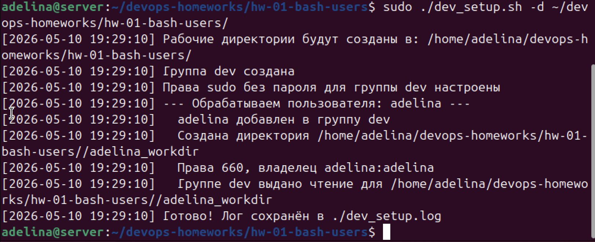

# HW-01: Bash — управление пользователями и группами

## Задание

Написать bash-скрипт который:

- Создаёт группу `dev` и добавляет в неё всех не системных пользователей (UID ≥ 1000)
- Выдаёт группе `dev` права на `sudo` без запроса пароля
- Для каждого пользователя создаёт директорию по маске `<username>_workdir`
- Путь до директорий задаётся через ключ `-d`, если ключ не передан — путь запрашивается интерактивно
- Директории создаются с правами `660`, владелец — пользователь, группа — его первичная группа
- Группе `dev` выдаётся доступ на чтение для всех созданных директорий (через ACL)
- Весь лог пишется одновременно в stdout и в файл `dev_setup.log`

## Запуск

```bash
chmod +x dev_setup.sh

# с указанием пути через ключ -d
sudo ./dev_setup.sh -d /путь/к/директориям

# без ключа — путь будет запрошен интерактивно
sudo ./dev_setup.sh
```

> Требуется: `sudo`, пакет `acl` (`sudo apt install acl`)

## Результат выполнения



Скрипт выполнился успешно:
- создана группа `dev`
- настроен sudo без пароля для группы `dev` через `/etc/sudoers.d/dev_nopasswd`
- пользователь `adelina` добавлен в группу `dev`
- создана директория `adelina_workdir` с правами `660`
- группе `dev` выдано чтение на директорию через ACL
- лог сохранён в `./dev_setup.log`
